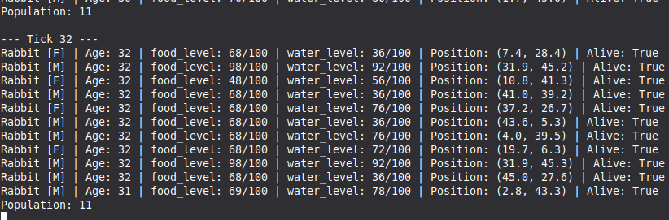
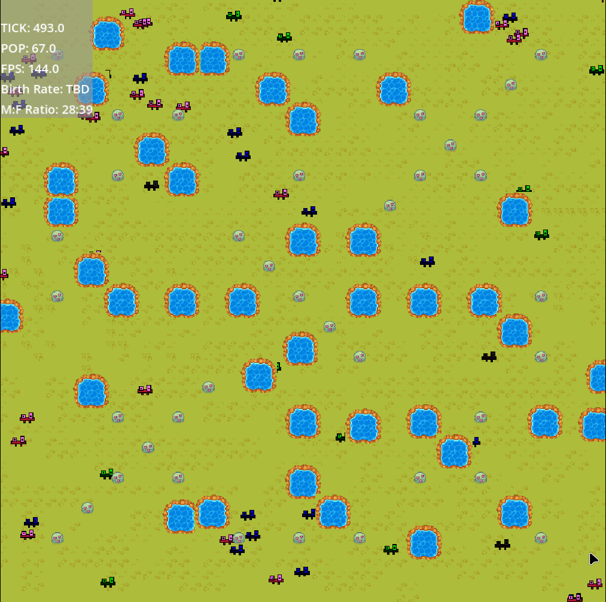
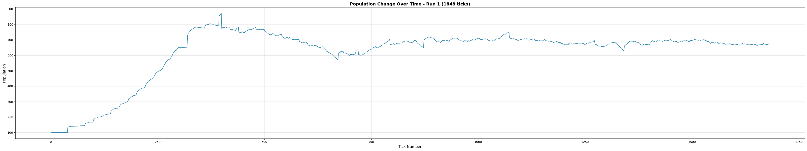

# Ecosystem Simulation & Analytics Platform

  
A continuously running server-based simulation of a living ecosystem populated by autonomous entities and world objects. The simulation can be controlled in real time via a CLI — run, paused, reset, and configured to adjust environmental settings. All simulation data is sent to Godot for high-performance visualization using WebSockets and logged to a SQLite database. Live telemetry is displayed directly within the Godot scene, while deep data science experiments and research reports are generated via Python scripts and Jupyter Notebooks.

**Inspiration:** icosco's "I Made an Evolution Simulator (with silly little guys)" (part 1)
[https://youtu.be/f7vH2Li9KOw?si=tzwzBUNQQldcVpnf](https://youtu.be/f7vH2Li9KOw?si=tzwzBUNQQldcVpnf)

-----

## Live Demo

> 🔗 Coming soon — my personal simulation will be publicly accessible via browser once deployed.

Once live, you will be able to:

  - Watch the simulation running in real time from any browser.
  - View live population stats and ecosystem vitals via the integrated Godot HUD.

-----

## Open Source

This project is free and open source. You are welcome to clone it, run your own simulation locally, modify the rules, and experiment with your own ecosystems.

-----

## Architecture

```
┌──────────────────┐        ┌───────────────────┐
│  PYTHON SERVER   │        │     GODOT 4       │
│    websockets    |◄──────►│  Visual World     │
│                  │        │ (MultiMesh Render)│
│    The Brain     |        |         +         |
|     SQLlite      │        │   Live HUD Stats  │
└────────┬─────────┘        └───────────────────┘
         │
         ▼
┌──────────────────┐
│ ANALYTICS ENGINE │       
│  Standard 10     │ 
│  PNG Reports     |
|                  |
|     PANDAS       |
|  Jupyter Custom  |
└──────────────────┘

Python → WebSocket → Godot (Live visuals + HUD Telemetry)
Python → SQLite → Matplotlib (Automated PNG reports)
Python → SQLite → Pandas/Jupyter (Deep research & custom analysis)
```

  - **Python Server** — The main engine. Runs the simulation math, stores data in SQLite (WAL mode), and communicates via WebSockets.
  - **Godot 4** — Visual client that renders thousands of agents using **MultiMeshInstance2D**. Includes a transparent "F3-style" overlay for live stats.
  - **Analytics Engine** — A Python suite that reads the SQLite database to generate a "Standard 10" set of visual reports and plots.

-----

## Repository Structure

```
my-ecosystem/
├── manager.py           # CLI Controller (create, resume, report)
├── server/              # Python simulation engine and logic
│   ├── main.py
│   ├── simulation.py
│   ├── database.py
│   └── data/
│       └── ecosystem.db  # SQLite database
├── game_directory/      # Godot 4 project (MultiMesh + HUD)
├── reports/             # Automated PNG/PDF analytical charts
├── analysis.ipynb       # Jupyter Notebook for custom data science
├── README.md
└── .gitignore
```

-----

## Tools & Libraries

**Tools:**

  - **Python** — Primary programming language.
  - **Godot 4** — Game engine for the visual ecosystem and live UI.
  - **SQLite3** — Database management (built into Python).

**Python Libraries:**

  - **FastAPI / WebSockets** — Real-time data streaming to Godot.
  - **Pandas** — Data manipulation and statistical analysis.
  - **Matplotlib / Seaborn** — Generating high-resolution research reports.

-----

## Local Setup

```bash
# clone the repo
git clone https://github.com/emmanueltab/my-ecosystem.git
cd my-ecosystem

# Create the virtual environment
python3 -m venv venv

# Activate it (Linux/Mac)
source venv/bin/activate
# On Windows: .\venv\Scripts\activate

# Install dependencies
pip install -r requirements.txt

# Run the manager
python3 manager.py
```

-----

## Deployment

The simulation is designed to run 24/7 on a server:

  - **Godot visual world** — Exported as a web app (Wasm), viewable in any browser with integrated live stats.
  - **CLI Management** — Control the simulation remotely via SSH.
  - **Report Generation** — Generate and download PNG analytics from the server at any time.

-----

## Build Phases

| Phase | What Gets Built | Difficulty | Est. Time |
|-------|----------------|------------|-----------|
| 1 | Python simulation engine | ⭐⭐ Medium | 1-2 weeks |
| 2 | SQLite persistence (WAL Mode) | ⭐ Easy | 2-3 days |
| 3 | Godot MultiMesh Visuals | ⭐⭐⭐ Hard | 2 weeks |
| 4 | Integrated Godot HUD | ⭐ Easy | 3-5 days |
| 5 | Automated Report Scripts | ⭐⭐ Medium | 1 week |
| 6 | Cloud deployment | ⭐⭐ Medium | 3-5 days |

-----

## Checklist

  - [ ] Optimize database (WAL mode).
  - [ ] Refactor Godot nodes to **MultiMeshInstance2D** for 1,000+ entities.
  - [ ] Build "F3-style" Telemetry Overlay in Godot.
  - [ ] Implement `report` command in CLI for automated PNG generation.
  - [ ] Add natural selection algorithms.
  - [ ] Add new predator
  - [ ] Create sprites for water, grass, and predators.

-----

 ## 📈 Status and Screenshots:

optimizing the database. simulation stops running after many ticks. figure out how the final product will look like when done.


Terminal: 12 erfs, 10 water, 10 food:





From godot: 200 "erfs", 10 water, 10 food.





A graph showing the population over many ticks. 100 erfs, 50 food, and 50 water evenly distributed across the world:




--- 
## License

MIT License — free to use, modify, and distribute.